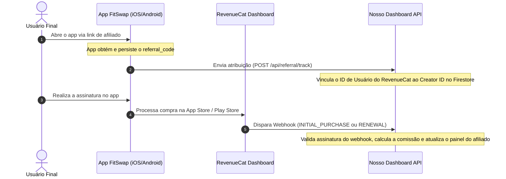

# Integração do Rastreamento RevenueCat — App FitSwap

Para que os afiliados e você (administrador) vejam informações reais sobre assinaturas e conversões, é necessário conectar o aplicativo mobile **FitSwap** ao RevenueCat e configurar a comunicação com este sistema de afiliados.

Abaixo está o guia passo a passo para realizar essa integração.

---

## 💻 Diagrama do Fluxo de Atribuição



---

## 📑 Passo a Passo da Integração

### Passo 1: Configuração do Projeto no RevenueCat
1. Acesse o **[RevenueCat Dashboard](https://app.revenuecat.com/)** e abra o projeto **Fitswap**.
2. Vá em **Project Settings** > **Apps** e adicione as suas plataformas (ex: iOS App Store, Google Play Store).
3. **Chaves de API Reais**:
   *   Vá em **Project Settings** > **API Keys**.
   *   Crie chaves de API públicas de produção para iOS e Android.
   *   No código do app em `mobile-app/services/iapService.ts`, substitua os valores de `REVENUECAT_API_KEYS` (substitua a chave de teste `test_rrjWVLlruBRGhxmVsivcecMNFLa` pelas suas chaves reais de produção).
4. **Configuração de Certificados (Apple/Google)**:
   *   **iOS**: Faça upload do certificado da App Store (`Shared Secret` ou arquivo `.p8` de In-App Purchase Key).
   *   **Android**: Configure a credencial do Google Service Account para permitir a comunicação com a Play Store.

---

### Passo 2: Configuração de Produtos, Entitlements e Offerings no RevenueCat
No painel do RevenueCat, crie a estrutura de vendas:

1. **Entitlements**:
   *   Crie um Entitlement com o ID exato: `Fitswap Pro`. *(Este ID deve bater com a constante `ENTITLEMENTS.PRO` em `iapService.ts`)*.
2. **Products**:
   *   Mapeie os identificadores reais de produtos da App Store Connect e do Google Play Console.
   *   Associe os produtos de assinatura anual ao plano **Yearly** e os mensais ao plano **Monthly**.
3. **Offerings**:
   *   Crie uma Offering marcada como **Current**.
   *   Dentro dela, adicione os pacotes `annual` (anual) e `monthly` (mensal) associando-os aos seus respectivos produtos configurados na etapa anterior.

---

### Passo 3: Captura e Registro do Código de Indicação (App FitSwap)
No primeiro boot do app, se o usuário veio por um link do afiliado (ex: `fitswap.com/join/MARIA10`), o app captura o código `MARIA10` e envia para a API do painel.

1. Identifique no app **FitSwap** o ID de usuário utilizado no RevenueCat (geralmente chamado de `App User ID` no SDK do RevenueCat).
2. Assim que o app for inicializado e obtiver o código do afiliado, dispare uma requisição `POST` para o endpoint da API de afiliados:
   *   **URL**: `https://seu-painel-afiliados.com/api/referral/track`
   *   **Payload (JSON)**:
       ```json
       {
         "device_id": "IDENTIFICADOR_UNICO_DO_APARELHO",
         "referral_code": "MARIA10",
         "source": "deep_link",
         "revenuecat_user_id": "ID_DE_USUARIO_DO_REVENUECAT"
       }
       ```
3. **Importante**: Certifique-se de preencher o `revenuecat_user_id` na requisição acima. É este campo que conecta o usuário do app ao RevenueCat no nosso banco de dados.

---

### Passo 4: Configurar o Webhook no Painel do RevenueCat
Agora você precisa configurar o RevenueCat para notificar o sistema de afiliados sempre que houver uma compra, renovação ou reembolso.

1. Acesse o **RevenueCat Dashboard** e selecione o projeto do **FitSwap**.
2. No menu lateral, acesse **Integrations** > **Webhooks**.
3. Clique em **Add New Webhook**.
4. Configure os seguintes campos:
   *   **Webhook URL**: `https://seu-painel-afiliados.com/api/webhook/revenuecat?app_id=fitswap`
       *(Adicionar o parâmetro `?app_id=fitswap` garante que o painel atribua a assinatura ao FitSwap corretamente)*.
   *   **Authorization header (Opcional)**: Caso utilize validações extras.
5. Em **Event Types**, marque obrigatoriamente:
   *   `Initial Purchase` (Primeira compra)
   *   `Renewal` (Renovações)
   *   `Refund` (Reembolso/Estorno)
   *   `Cancellation` (Cancelamento)
6. Salve a integração.

---

### Passo 5: Configurar a Chave Secreta de Validação
O RevenueCat gera uma assinatura de segurança no cabeçalho das requisições para garantir que ninguém envie dados falsos para a sua API.

1. No painel do RevenueCat, copie o segredo do webhook gerado (**Webhook Secret**).
2. Acesse os servidores onde o painel de afiliados está hospedado (ex: Vercel, Railway, etc.).
3. Adicione a variável de ambiente no seu arquivo `.env.local` e nas configurações do servidor de produção:
   ```env
   REVENUECAT_WEBHOOK_SECRET=o_segredo_copiado_do_revenuecat
   ```
4. O backend do painel lerá esta variável e validará a assinatura (`x-revenuecat-signature`) recebida.

---

### Passo 6: Teste da Integração
Antes de colocar em produção, valide se o fluxo funciona:

1. Use o ambiente de testes (**Sandbox**) da App Store/Play Store no app FitSwap.
2. Realize uma compra de teste com um usuário que foi atribuído previamente a um cupom de afiliado no passo 3.
3. No console do RevenueCat, use a ferramenta de envio de testes de webhook (**Test Webhook**) ou analise o log de eventos para confirmar que a API do painel respondeu com sucesso (`200 OK`).
4. Verifique no Painel Admin (`/admin/commissions`) se a comissão de teste apareceu com o status `Pendente`.

